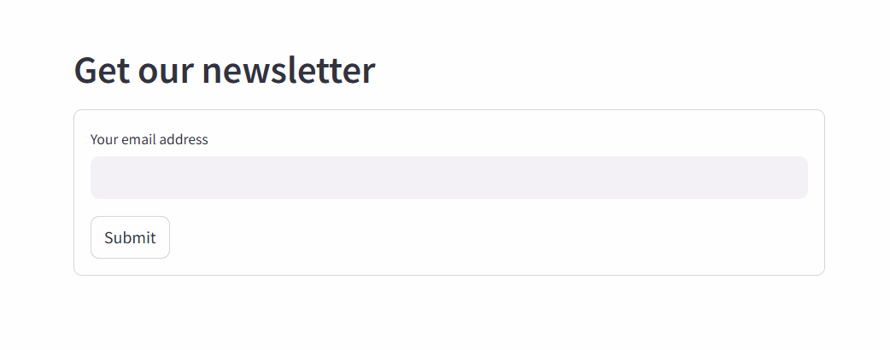

# News API - Receive Daily News by Email  

This project is a **Web API developed in Python** that allows users to **enter their email address** and receive the **latest news** directly in their inbox.  

## Features  
- ✅ Fetch news using the [NewsAPI](https://newsapi.org/)  
- ✅ Send news via email using **SMTP**  
- ✅ Simple user interface with **Streamlit**  

---

## Technologies Used  
- **Python**  
- **Requests** (for fetching news)  
- **Smtplib** (for sending emails)  
- **Streamlit** (simple user interface)  

---

## Preview  
-   

---

## Installation  

1. **Clone the project**  
   ```bash
   git clone https://github.com/RIKIEL-K/news-api-email.git
   cd news-api-email

